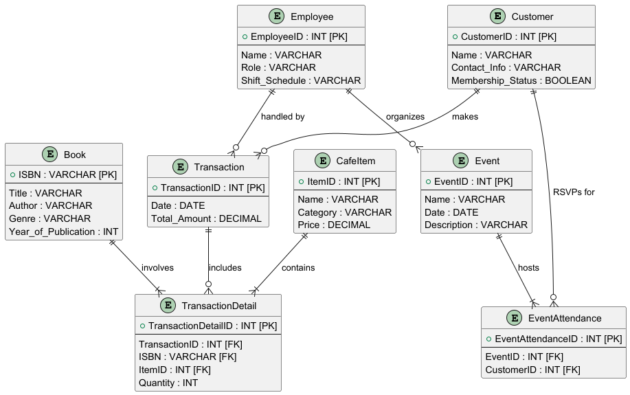
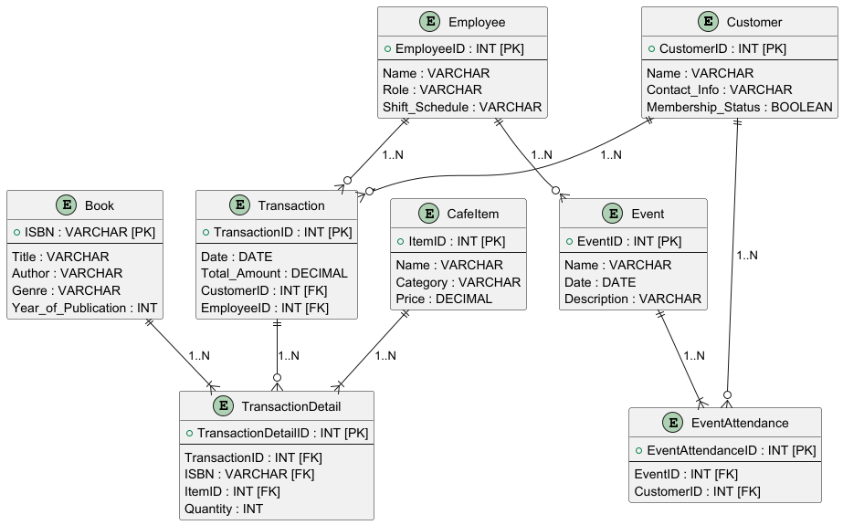

# Database Design and Optimization: Books & Brews Integrated Bookstore and Café Management System

## Table of Contents
1. [Overview](#overview)
2. [Authorship and Ownership](#authorship-and-ownership)
3. [Project Structure](#project-structure)
4. [Business Background Story](#step-1-business-background-story)
5. [Conceptual Entity Relationship Model](#step-2-conceptual-entity-relationship-model-er-model)
6. [Entity Relationship Diagram (ERD)](#step-3-entity-relationship-diagram-erd)
7. [Conversion to Relational Model](#step-4-conversion-to-relational-model)
8. [Normalization to 3NF](#step-5-normalization-to-3nf)
9. [Final Model](#step-6-final-model)
10. [PlantUML Integration](#plantuml-integration)
11. [Conclusion](#conclusion)

## Overview

This repository contains the comprehensive database design project for Books & Brews, a fictional bookstore and café. The project demonstrates a thorough approach to database design, from conceptual modeling to a fully normalized relational model.

## Authorship and Ownership

This project is the original work of **Panagiotis Georgiadis**, a graduate student in Computer Science at the University of Colorado Boulder. All rights reserved. © 2024 Panagiotis Georgiadis

This work is protected by copyright law. Unauthorized use, reproduction, or distribution of this material without express written permission from the author is strictly prohibited. For permissions or inquiries, please contact Panagiotis Georgiadis through the University of Colorado Boulder, Department of Computer Science.

## Project Structure

- `README.md`: This file, providing a detailed overview of the project and the full database design report.
- `ERD_Diagram.png`: Entity Relationship Diagram visualizing the database structure.
- `Relational_Model_Diagram.png`: Diagram of the final relational model.
- `ERD_Diagram.puml`: PlantUML source file for the ERD.
- `Relational_Model_Diagram.puml`: PlantUML source file for the Relational Model.
- `ERD_Documentation.md`: Detailed documentation of the Entity-Relationship Diagram.

## ERD Documentation

This project includes a comprehensive documentation of the Entity-Relationship Diagram (ERD) in the file [`ERD_Documentation.md`](ERD_Documentation.md). This document provides an in-depth explanation of the entities, attributes, and relationships that form the foundation of the Books & Brews database design.

Key features of the ERD documentation:

1. Detailed overview of each entity (Customer, Book, Café Item, Employee, Transaction, Event, Inventory) with their attributes and data types.
2. Explanation of relationships between entities, including cardinality (one-to-many, many-to-many).
3. Description of linking tables (Transaction_Detail, Event_Attendance) that resolve many-to-many relationships.
4. A text-based ASCII representation of the ERD for quick reference.
5. Summary of how the ERD captures the key functionalities of Books & Brews.

This documentation serves as a valuable resource for understanding the database structure, supporting implementation, and facilitating future maintenance or expansion of the system.

## Step 1: Business Background Story

The business selected for this database project is a fictional **bookstore and café** called "Books & Brews." Located in a bustling neighborhood, this store serves as both a retail bookstore and a cozy café that caters to book lovers and casual customers. The business aims to provide a welcoming environment where customers can browse books, enjoy coffee and snacks, and attend events like book signings, readings, and literary discussions.

The bookstore offers a variety of books, including fiction, non-fiction, self-help, and children's books. Each book is cataloged by ISBN, title, author, genre, and year of publication. The café, on the other hand, serves a range of beverages, pastries, and sandwiches, each of which is tracked in a separate menu with categories such as beverages, desserts, and light meals. The business model involves multiple revenue streams: retail book sales, café item sales, and special event fees.

Books & Brews also features a **membership program**, allowing customers to sign up for different membership tiers that provide benefits such as discounts on books and café items, as well as early access to tickets for events. Each membership tier is tracked along with customer purchase history, providing valuable data for targeted marketing and personalized offers. The business employs a team of baristas, cashiers, and event coordinators to manage the café, bookstore, and events, ensuring smooth operations and excellent customer service.

**Assumptions:**
1. Each customer can purchase multiple books and/or café items in a single transaction.
2. Customers have the option to sign up for memberships, which offer discounts and special privileges like priority seating at events.
3. Memberships are tracked along with customer purchase history, allowing personalized recommendations and offers.
4. Employees are assigned to specific shifts and have roles such as cashiers, baristas, or event coordinators.
5. Inventory for books and café items is managed separately, and stock levels are updated in real-time based on transactions.
6. Events have specific dates, times, and may involve authors or special guests. Customers can RSVP for events, and seating capacity is tracked to ensure attendance limits are not exceeded.

## Step 2: Conceptual Entity Relationship Model (ER Model)

The conceptual ER model for Books & Brews includes the following entities:

1. **Customer**: Tracks customer details such as Customer ID, Name, Contact Information, and Membership Status.
2. **Book**: Represents the books available in the store, identified by ISBN, Title, Author, Genre, and Year of Publication.
3. **Café Item**: Represents items sold in the café, including Item ID, Name, Category, and Price.
4. **Employee**: Tracks employee details, including Employee ID, Name, Role, and Shift Schedule.
5. **Transaction**: Captures the details of each transaction, with fields like Transaction ID, Date, and Total Amount.
6. **Event**: Represents events held in the bookstore, with Event ID, Name, Date, and Description.
7. **Inventory**: Represents the stock levels for Books and Café Items, tracking Item ID/ISBN, Quantity, and Restock Dates.

**Relationships:**
1. A Customer can have many Transactions, and each Transaction involves multiple Book and Café Item purchases.
2. Employees handle Transactions and are assigned to manage Events.
3. Events are attended by Customers, and Customers can RSVP for Events.
4. Books and Café Items are linked to Inventory to manage stock levels. Inventory is adjusted based on transactions.
5. Memberships are tied to Customers and impact transaction pricing by applying discounts.

## Step 3: Entity Relationship Diagram (ERD)

The ERD was created to visually represent the above entities and their relationships using Crow's Foot notation. Primary and foreign keys are clearly marked to illustrate how entities are interconnected. Each entity is represented as a table with its attributes, and relationships are shown using connecting lines with notations that describe the type of relationship (one-to-one, one-to-many, etc.).

- **Customer** is connected to **Transaction** with a one-to-many relationship, as a customer can have multiple transactions.
- **Transaction** is connected to both **Book** and **Café Item** through a linking table, **Transaction Detail**, which captures the quantity and type of each item purchased.
- **Event** is connected to **Customer** through a linking table, **Event Attendance**, which tracks the customers attending each event.
- **Employee** is linked to **Transaction** and **Event** entities, representing which employee handled the transaction or managed the event.
- **Inventory** is linked to **Book** and **Café Item** through a one-to-one relationship, ensuring stock levels are updated per transaction.

## Step 4: Conversion to Relational Model

The relational model was developed by converting the ERD into relational schemas. Each entity corresponds to a table in the database, and relationships between entities are established through foreign keys. The following schemas were derived from the ERD:

1. **Customer (Customer_ID, Name, Contact_Info, Membership_Status)**
2. **Book (ISBN, Title, Author, Genre, Year_of_Publication)**
3. **Café_Item (Item_ID, Name, Category, Price)**
4. **Employee (Employee_ID, Name, Role, Shift_Schedule)**
5. **Transaction (Transaction_ID, Date, Total_Amount, Customer_ID, Employee_ID)**
6. **Event (Event_ID, Name, Date, Description)**
7. **Transaction_Detail (Transaction_ID, ISBN, Item_ID, Quantity)**
8. **Event_Attendance (Event_ID, Customer_ID)**
9. **Inventory (Item_ID/ISBN, Quantity, Restock_Date)**

The relational schemas ensure referential integrity by maintaining primary and foreign keys between related tables. For example, `Customer_ID` in the `Transaction` table is a foreign key that references `Customer_ID` in the `Customer` table.

## Step 5: Normalization to 3NF

The relational model was normalized to the Third Normal Form (3NF) by following these steps:

1. **First Normal Form (1NF)**: Each table has unique rows, and each field contains only atomic values. For example, in the `Customer` table, the `Name` attribute is divided into `First_Name` and `Last_Name` to maintain atomicity.
2. **Second Normal Form (2NF)**: All non-key attributes are fully dependent on the primary key. For instance, `Customer_ID` in the `Transaction` table is the only determinant for attributes like `Total_Amount`.
3. **Third Normal Form (3NF)**: All non-key attributes are independent of each other and directly dependent only on the primary key. In the `Transaction` table, `Date` is independent of `Total_Amount` and both are dependent only on `Transaction_ID`.

During the normalization process, some tables were modified to remove transitive dependencies. For example, the `Event` table was adjusted to ensure attributes like `Event Name` and `Description` were only dependent on the primary key, `Event_ID`.

## Step 6: Final Model

The final relational model meets all the normalization criteria and is ready for implementation. It supports efficient querying for a variety of use cases, such as:

- **Generating reports** on book and café item sales.
- **Tracking inventory levels** to automate restocking.
- **Analyzing customer behavior** by reviewing purchase histories and event attendance.
- **Managing employee shifts and roles** to optimize scheduling and staffing.

This relational model not only addresses the current needs of Books & Brews but is also scalable, allowing for future expansions like an online ordering system or integration with a customer loyalty program.

## PlantUML Integration

This project showcases the use of PlantUML for creating database diagrams. The `.puml` files in this repository (`ERD_Diagram.puml` and `Relational_Model_Diagram.puml`) can be used to regenerate or modify the diagrams as needed. This demonstrates proficiency in using PlantUML for database modeling and documentation.

## Conclusion

The Books & Brews database design project successfully covers all the essential steps of database design, from conceptual modeling to a fully normalized relational model in 3NF. The background story is comprehensive and aligns well with the entities and relationships defined in the ER model and ERD. The relational model was derived accurately, maintaining referential integrity and supporting complex queries. The normalization process eliminated redundancies and ensured a robust design that supports the business operations of Books & Brews.

This project demonstrates a strong understanding of database design principles and showcases the ability to create a practical, real-world application. The resulting database structure will enable Books & Brews to efficiently manage its inventory, sales, and customer interactions, providing a solid foundation for future growth and development.